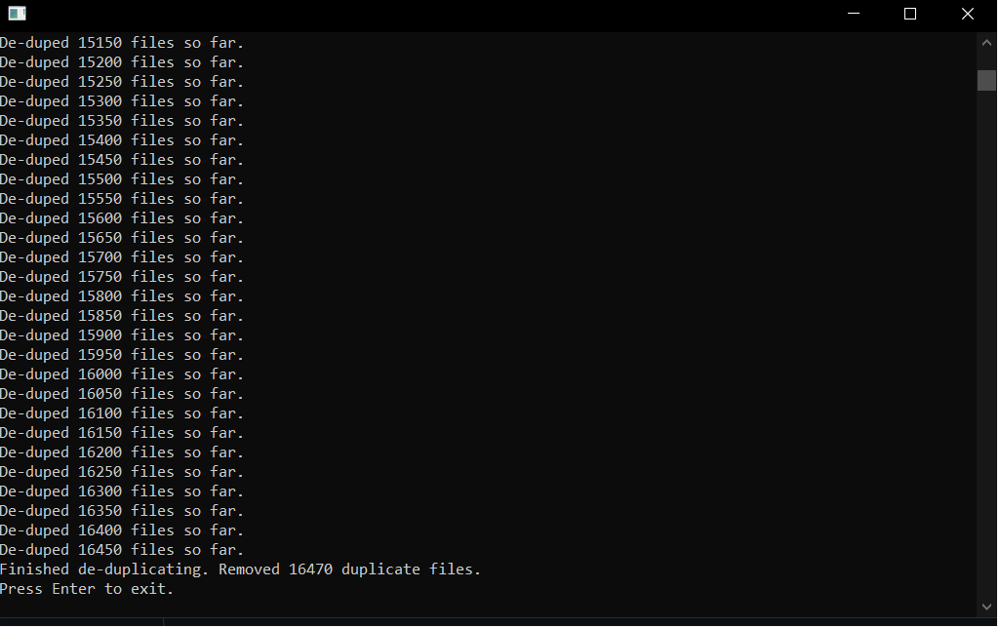

# go-file-dedupe

**DISCLAIMER:
You assume full responsibility when running this program. I am not responsibile for any intentional / accidental data loss.
This software also has no concept of which file is the "original". It may not find your files in order, so it may delete one from the folder you're familiar with it in. If you have a preference for maintaining file location for the "original" file, then you shouldn't use this software.**

## What does this software do?
go-file-dedupe recursively searches and removes duplicate files from the binarys working directory. It uses sha256 to hash files to compare against future files to identify duplicates. 

In personal testing it removed 16470 duplicate files from a 150GB pool (on an HDD) of files in the span of ~30 minutes. I assume that it would complete much faster on an SSD.

## Example output

_Note that we only print to stdout every 50 messages as to not slow down the program. Since disk io is sequential, doing stdout on one goroutine and deleting on another in my mind wouldn't boost performance. I could be wrong, please let me know if this is not the case._
